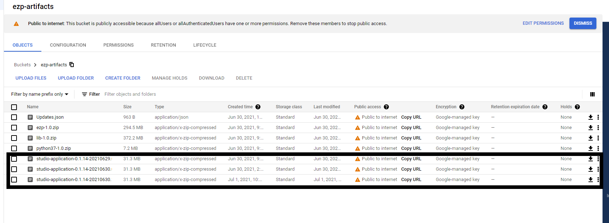

# STUDIO APPLICATION

## 1. Create Google bucket

### 1.1 **Navigate to Storage —&gt; Browser from the left navigation pane.**


### 1.2  **Select Create Bucket.**


### 1.3  **Provide a unique and meaningful name for the bucket name and then, click Continue.**


### **1.4 Select the location type and click Continue.**


### **1.5 Choose the Storage Class and click Continue.**


### **1.6 Select Fine-grained as the access control type and click Continue.**


### **1.7 Select the needed encryption type and click CREATE**


### **1.8  If the bucket creation is successful, you should get the below.**


### **1.9  In order to provide bucket access, navigate to Permissions.**


### **1.10 Provide Storage Object Admin role to public.**


## **2. Updates.json push in to google bucket.**

```javascript
{
    "Version": "0.1.14-20210629.090457-1",
    "RunCommand": "EZPassport.Studio.Main.exe",
    "AppParams": "",
    "WSB": "netcoreapp3.0",
    "Files": [
        {
            "Name": "ezp-1.0.zip",
            "URL": "https://storage.googleapis.com/ezp-artifacts/ezp-1.0.zip"
        },
        {
            "Name": "lib-1.0.zip",
            "URL": "https://storage.googleapis.com/ezp-artifacts/lib-1.0.zip"
        },
        {
            "Name": "python37-1.0.zip",
            "URL": "https://storage.googleapis.com/ezp-artifacts/python37-1.0.zip"
        },
        {
            "Name": "studio-application-0.1.14-20210629.090457-1.zip",
            "URL": "https://storage.googleapis.com/ezp-artifacts/studio-application-0.1.14-20210629.090457-1.zip"
        }
    ],
    "Envs": {
        "ML_PROC_EXEC_PATH": "python37/python.exe",
        "ML_PROC_ARGS": "-m ezpassport.server",
        "ML_PROC_WD": "../"
    }
}
```

## **3. Studio Application push into google bucket**

Get code from nexus and push it into google bucket.

{% embed url="https://nexus.zone24x7.lk/\#browse/browse:releases:com%2Fzone%2Fppema%2Fstudio-application" %}



## 4. python37 package **push into google bucket.**

Zip python37 folder and push into google bucket.




## 5. ML model push into **google bucket.**

you can collect models from git "  Insert Link".

Then create ezp/model directory and put models to that folder put models to that. Finally you can zip ezp folder and push into google bucket. 

## 6. Python Lib push into **google bucket.**

you can collect code from git "  Insert Link"

* Create folder "C:\Users\Apps\"
* Go inside that folder and open gitbash terminal and run below commands
* mkdir -p C:\Users\Apps\

```javascript
git clone <git link>

# Run Build Script
./pyarmour.sh
```

or double click  pyarmour.sh file

* Then go inside "C:\Users\Apps\ippylib\_pyarmor\library"
* Run following command

```javascript
pip install .
```

* Then copy C:\Users\Apps\ippylib\_pyarmor\library\ippylib to C:\Users\&lt;users&gt;\AppData\Roaming\Python\Python37\site-packages
* Copy site-packages to lib folder \(You can create lib folder anywhere\)  
* Then zip it and must send to the google bucket.

