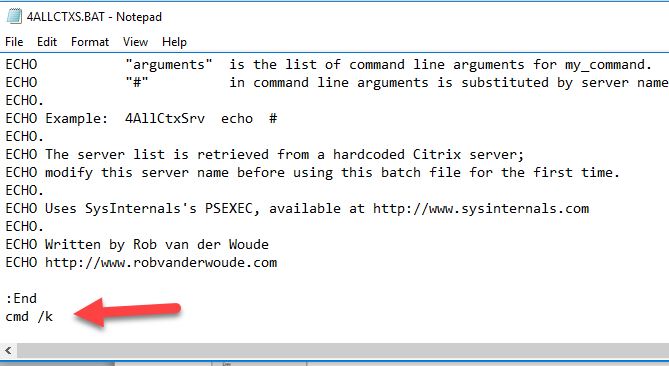

# Prompt From Closing After Running Commands \(Batch File Pause\)

## 3 Ways To Prevent Command Prompt From Closing After Running Commands \(Batch File Pause\)

March 30, 2017

When we run any batch file, the Command Prompt window will appear shortly and it goes on the same time and you do not exactly get what commands run on CMD as the result of the batch file.

The batch file contains commands to perform some actions related to System and these commands are executed one after another. So what if you want to watch your commands that you run through a batch file, and you want to prevent Command Prompt window from closing automatically.

Quick Summary \[[hide](https://www.itechtics.com/3-ways-to-prevent-command-prompt-from-closing-after-running-commands/#)\]

* [1 First way](https://www.itechtics.com/3-ways-to-prevent-command-prompt-from-closing-after-running-commands/#First_way)
* [2 Second Way](https://www.itechtics.com/3-ways-to-prevent-command-prompt-from-closing-after-running-commands/#Second_Way)
* [3 Third Way](https://www.itechtics.com/3-ways-to-prevent-command-prompt-from-closing-after-running-commands/#Third_Way)

Here are the 3 ways to prevent Command Prompt window from closing after running commands. Go for any solution you find easy and best for you.

### First way

Open the batch file in Notepad by right clicking on it and click on “Edit” from the list.

And paste the following command at the end of your batch file

“cmd /k”

Next, save the file by pressing “Ctrl+s” and close the notepad. Double click your .bat file. You will see that CMD will remain open as long as you want it to stay open.

This is the very easy and handy way to prevent the Command Prompt window from closing after running commands.

### Second Way

The second way I am going to show you is also a simple method.

Edit your bat file by right clicking on it and select “Edit” from the list. Your file will open in notepad.

Now add “PAUSE” word at the end of your bat file. This will keep the Command Prompt window open until you do not press any key.

You can easily see each command which had run on the result of bat file in CMD as long as you do not press any key.

### Third Way

You can prevent Command Prompt window from closing after running commands through adding a Registry Key in the Windows Registry. For this, type the following code in your Notepad and save the file with the  .reg extension.

Windows Registry Editor Version 5.00

\[HKEY\_CLASSES\_ROOT\Applications\powershell.exe\shell\open\command\]

@=”\ ”C:\\Windows\\System32\\WindowsPowerShell\\v1.0\\powershell.exe\” –noExit \ “& \\\ “%1\\\ ”\””

\[HKEY\_CLASSES\_ROOT\Microsoft.PowerShellScript.1\Shell\0\Command\]

@=”\ “C:\\Windows\\System32\\WindowsPowerShell\\v1.0\\powershell.exe\ “ –NoExit \ “-Command\” \”if \( \( Get-ExecutionPolicy \) –ne ‘AllSigned’\) { Set-ExecutionPolicy –Scope Process Bypass }; & \\\ ”%1” \\\ “\””

After saving the file, double click on it. This registry will save to your Registry Editor of Windows. Now run any command, the Command Prompt window will stay open as long as you will keep it open.

These all are easy and quick ways to keep your window of the Command Prompt open so that you can easily configure and watch each command which you run through the batch file or Powershell Script. If you want to know anything else related to this, comment below. Thank you.  

